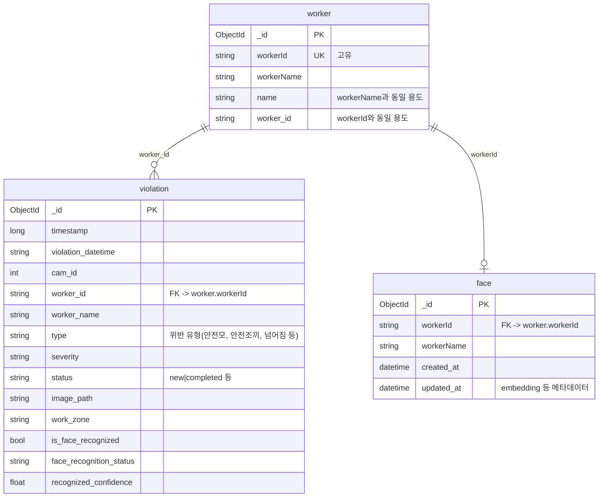

# 🚧 AIVIS

> **안전 장비 착용 검출 및 얼굴 인식 기반의 지능형 산업 현장 통합 관제 시스템**  
> 🔗 [배포 링크] | 📄 [Notion 문서](https://www.notion.so/AIVIS-30587486686f80eeb3d1cd15b4d8fab3)

<br>

## 📖 프로젝트 소개 (About)

**AIVIS**는 산업 현장에서 근로자의 안전 장비 착용 여부(PPE Detection)와 얼굴 인식을 통한 신원 확인을 동시에 수행하는 AI 통합 관제 시스템입니다.

- **제작 기간:** 2025.09.29 ~ 2025.12.10
- **참여 인원:** 4명 (팀장)
- **주요 역할:**
    - AI 모델 튜닝 및 최적화
    - 웹 프론트엔드 작업
    - 학습 데이터 정제

<br>

## ✨ 주요 기능 (Key Features)

- **🎥 실시간 영상 감시:** 현장 CCTV 영상 스트리밍 및 분석
- **⛑️ PPE 위반 감지:** 안전모, 안전조끼 등 미착용자 자동 검출
- **👤 얼굴 인식:** 등록된 근로자 신원 확인 및 출입 통제
- **🚨 위반 알림:** 안전 수칙 위반 발생 시 관리자에게 즉시 알림

<br>

## 🛠 기술 스택 (Tech Stack)

| 구분 | 스택 |
| :-- | :-- |
| **Frontend** | (e.g. React / Vue.js) |
| **AI/ML** |  (e.g. YOLOv8, FaceNet) |
| **Backend** | (e.g. FastAPI / Flask) |
| **Database** | (e.g. MongoDB / PostgreSQL) |
| **Tools** |   |

<br>

## 🏗 아키텍처 및 설계 (Architecture & Design)

### ERD (Entity Relationship Diagram)
- **Violations (`violation`)**: 위반 기록, 위반 유형(안전모 등), 스냅샷 이미지 경로
- **Workers (`worker`)**: 근로자 ID 및 이름
- **Faces (`face`)**: 얼굴 인식용 임베딩 데이터



### API 명세서
- 상세 API 명세는 [Google Docs 링크](https://docs.google.com/document/d/14cVjQWaY_msOKTbdNIh-24n4OxCFtvoqblClBMJQ9EE/edit?tab=t.0)에서 확인할 수 있습니다.

<br>

## 💭 회고 (Retrospective)

- **[Notion 회고록 링크]** (상세 내용은 링크 참조)
- **배운 점:** 객체 감지(Object Detection) 모델의 실시간 성능 최적화 기법
- **아쉬운 점:** (e.g. 조도 변화에 따른 인식률 저하 문제 해결의 어려움)

<br>

## 💻 설치 및 실행 (Installation)

```bash
# 1. Clone the repository
git clone https://github.com/Ihan0316/AIVIS.git

# 2. Install dependencies
# (Instructions)

# 3. Run application
# (Command)
```
